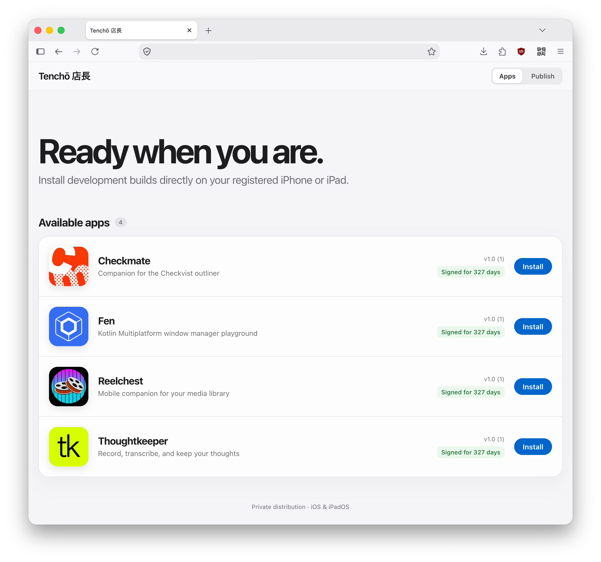

# Tenchou

Tenchou is a small, self-hosted catalog for installing development or ad-hoc
signed iOS applications over the air. It uses a React/TypeScript frontend with
TanStack Router and Query, and a Kotlin/Ktor backend.



## Development

```sh
./kotlin run
cd frontend && npm install && npm run dev
```

The Vite development server proxies `/api`, `/artifacts`, `/install`, and
`/instructions.md` to Ktor on port 8080.

## Production

The Ktor backend is built, tested, run, and packaged with JetBrains' Kotlin
Toolchain 0.11.1. The checked-in `./kotlin` wrapper pins and verifies the
toolchain distribution.

Production images keep the Vite output in `/app/web`, outside the JVM and
native executables. `TENCHOU_WEB_DIR` selects that directory and defaults to
`frontend/dist` for local packaged-server runs. This lets frontend-only changes
reuse the existing backend JAR and cached GraalVM Native Image layer.

Persist `/data` and expose the service through HTTPS. iOS rejects over-the-air
installation manifests and IPA URLs that are not served over HTTPS.

## Upload API

`POST /api/apps` accepts multipart fields `ipa`, `title`, `subtitle`, and an
optional `icon`. See `/instructions.md` on a running server for the complete
build and upload recipe.

`POST /api/builds/{bundleId}/reserve` atomically reserves and returns the next
numeric build for an app. Build scripts can pass the returned `build` value to
Xcode as `CURRENT_PROJECT_VERSION` before uploading the resulting IPA.

[`tenchou.example.sh`](./tenchou.example.sh) is a reusable one-command Xcode
archive, export, and upload example. Copy it into an iOS project and provide
the required Xcode container, scheme, and development team as environment
variables documented at the top of the script.
